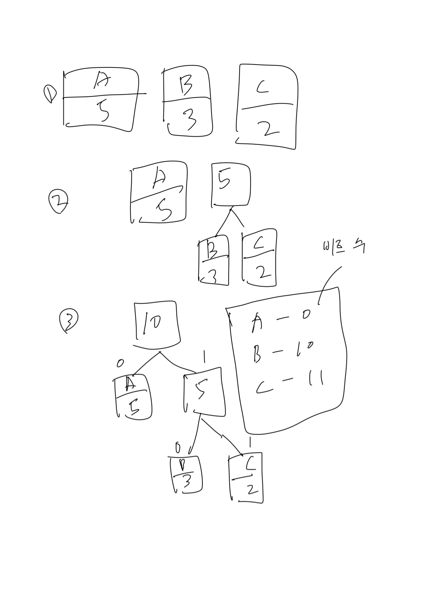

## 2. 문자표현

### 2.1 아스키코드

7비트로 되어있는 문자표. 문자 표현에 대한 표준방식이므로 모든 컴퓨터에서 동일하게 적용된다.

### 2.2 유니코드

아스키 코드로 표현하지 못하는 문자들이 많기 떄문에 16비트로 문자를 표현하는 유니코드라는 것을 만들었다.
예를 들어 W는 유니코드로 0057인데 한 자리씩이 4비트의 값이다.

### 2.3 데이터압축

데이터 저장 및 전송 시 크기를 줄여야 효율적. 텍스트를 압축하는 기술 중 허프만 코딩이라는 것이 있다.

예를들어 AAAAABBBCC라는 문자열이 있을 때
1) 문자의 빈도수를 먼저 확인한다.

    A - 5
    B - 3
    C - 2

2) 가장 적은 빈도수의 문자 2개를 빈도수의 합의 자식 노드로 정의한다. 예시에선 B,C 이므로
    
    5(빈도 수 합) - B,C

3) 더 이상 합칠 빈도수의 노드가 없을 때까지 반복한다.

그럼 결과적으로 

위 이미지처럼 트리가 만들어지고 A: 0, B: 10, C: 11로 비트 수가 결정된다. 따라서 AAAAABBBCC(10바이트) --> 000001010101010101111(21비트) 로 압축된다.

## 3. 정수표현

### 3.1 정수표현방식
정수는 보통 32비트로 표현한다. 즉 232 의 경우의 수만큼 정수 표현이 가능하다. 맨 앞의 비트는 부호이며 0이면 양수, 1이면 음수이다.

컴퓨터에선 정수를 2의 보수 표기법으로 표현한다.

방식은 다음과 같다.

1) 어떤 양수 n의 이진수에 대해 0은 1로 1은 0으로 바꾼다.
2) 1의 결과값에 1을 더한다. 최종 값을 n에 대한 2의 보수라 한다.

정수의 뺼셈은 모두 덧셈으로 처리된다. 즉 5 - 4는 5 + (-4) 로 처리된다.

그런데 덧셈과 뺼셈 연산과정에서 정수 표현크기(32비트)를 초과하게 되면 결과가 예상과는 다르게 나온다. 따라서 연산 시 범위를 초과하는지 확인해야한다.

## 4. 실수표현

### 4.1 실수표현방식

지수형식: m X re
m: 가수, r: 밑수, e: 지수

- 단일 정밀도 형식(java에서는 float)
  - 8비트 지수의 4바이트 형식
  
- 이중 정밀도 형식(java에서는 double)
  - 11비트 지수의 8바이트 형식

ex. -0.0011012 * 22를 컴퓨터에서는 어떻게 처리?(단일 정확도라고 가정)

1) 1.xxx가 되게 처리. 이를 정규화라고 함 
   1) -1.1012 * 2-1
2) 지수에 바이어스(IEEE 754에서는 127)를 더한다.
   1) -1 + 127 = 126
   2) -1.1012 * 2126
3) 가수의 부호가 맨 앞 1비트, 다음 지수를 8비트(단일 정확도)로 변환한 값. 다음 소수점 아래 부분 비트를 나머지 비트에 채움.
   1) 음수이므로 맨 앞은 1
   2) 126을 8비트로 표현하면 01111110
   3) 소수점 아래는 101
   4) 결과는 10111111010100000000000000000000

