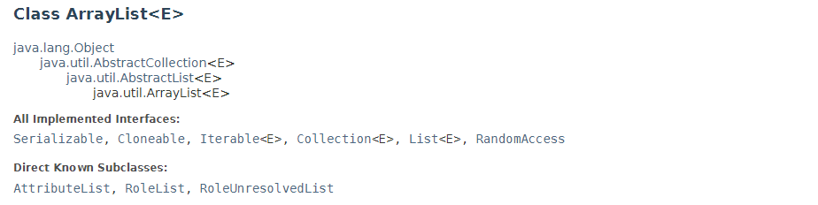

## 상속과 다형성

인터페이스와 추상클래스에 대해 알아보기 전에 상속과 다형성에 대해 명확히 이해하는 것이 중요하다고 생각했다. 왜냐하면 인터페이스와 추상클래스를 사용하는 목적의 차이가 상속과 다형성의 차이에서 기인한다고 생각했기 때문이다.

### 상속이란

상속의 장점은 무엇일까?

1. 기존에 작성된 클래스를 재활용할 수 있습니다.
2. 자식 클래스 설계 시 중복되는 멤버를 미리 부모 클래스에 작성해 놓으면, 자식 클래스에서는 해당 멤버를 작성하지 않아도 됩니다.
3. 클래스 간의 **계층적 관계**를 구성함으로써 다형성의 문법적 토대를 마련합니다.
(출처: https://www.tcpschool.com/java/java_inheritance_concept)

여기서 중요한 대목은 3번의 계층적 관계를 구성한다는 의미라 생각한다. 즉 상속은 객체지향적 관점에서 두 객체 간의 관계가 계층적일 때를 말한다. 


자식은 부모가 먼저 존재하지 않는 한 존재할 수 없다. 부모-자식 간 관계에선 시간적 관점에서 계층 관계가 명확하다. 객체지향에서 상속이란 부모-자식 관계와 같이 계증관계가 명확하고 하위객체가 상위객체의 특징(상태, 행동 등)에 영향을 받는 관계일 때를 말한다고 볼 수 있다.

### 다형성이란

다형성은 객체지향적 관점에서 정의해보면 상위 타입의 변수가 하위 타입 객체를 참조할 수 있음을 의미한다. 코드로 이해해보자면

```java
public interface Food {
    void xxxMethod();
}

public class Pizza implements Food {
    public void xxxMethod(){
        ...생략
    }
}

public class Chicken implements Food {
    public void xxxMethod(){
        ...생략
    }
}

public class Main {

    public static void main(String[] args){
        Food a = new Pizza();
        Food b = new Chicken();
    }
}

```

위 코드에서 확인할 수 있듯이 Food라는 상위 타입으로 Pizza, Chicken이라는 하위타입 객체의 주소 값을 참조할 수 있다. 물론 상속관계에서도 부모 타입은 자식 타입의 변수를 참조할 수 있다. 그러나 상속을 사용하는 목적은 상위타입의 변수로 하위타입의 변수를 참조하기 위함이 아니라 객체 간 계층관계를 정의하기 위함이다. 그렇다면 다형성은 무엇을 위한 개념일까?

### 추상화

객체란 간단히 말해 실제 세계에 존재하는 것을 코드로 표현한 것이라고 생각한다. 예를들어 사과를 코드로 표현하기 위해서, 더 구체적으로 java의 class로 표현하기 위해서 어떤 절차가 필요할까? 먼저 사과의 특징을 알아내야 할 것이다. 색깔, 맛, 모양 등 특징이 있다. 또 사과는 떨어지기도 하고 익어가기도 한다. 이런 행동들도 알아내야한다. 그런데 사과는 또 과일이라는 개념으로 나타낼 수도 있다. 이렇게 실세계의 것을 class로 나타내려면 그것의 일반적인 무언가를 고민해서 결정해야 한다. 이를 '**추상화한다**'라고 정의할 수 있다.


기능을 만들 때를 생각해보면 일반적인 것이 있고 세부적인 것이 있다. 예를 들어 결제기능을 생각해보자. 결제금액 지불, 결제 처리, 결제 결과 반환 등이라는 일반적인 것이 있다면 금액 지불을 카드로 할지 계좌송금으로 할지, 결제 결과를 문자메시지로 반환할 지 카톡으로 반환할 지 등 세부적인 것이 있다. 추상화를 통해 일반적인 것을 정의하고 실제 세부적인 것은 구현하는 방식으로 하면 유연하게 기능개발이 가능해진다. 

정리해보자면 상속은 계층관계를 정의하는 것이 목적이고, 다형성은 추상-구체 관계를 정의하는 것이 목적이라고 생각한다.

## interface와 Abstract class

interface는 위에서 설명했듯 추상화를 하기 위해 사용한다. interface에 객체의 행동을 큰 틀에서 정의하고 실제 구현하는 쪽에서 행동을 세부적으로 정의한다.

그럼 Abstract class는 어떨 때 사용할까? 내가 이해했을 때는 하위타입이 상위타입의 상태는 상속을 받고 핵심적인 행동은 하위타입에서 구현하고자 할 때 사용하는 것 같다.

예들들어 java.util 패키지의 ArrayList의 java 문서를 살펴보자.



ArrayList는 AbstractList를 상속받고 있으며 List 인터페이스를 구현하고 있다. 왜 이렇게 했을지 java doc을 살펴보면 이런 말이 나온다.

>To implement an unmodifiable list, the programmer needs only to extend this class and provide implementations for the get(int) and size() methods.

>To implement a modifiable list, the programmer must additionally override the set(int, E) method (which otherwise throws an UnsupportedOperationException). If the list is variable-size the programmer must additionally override the add(int, E) and remove(int) methods.

변경 불가능한 리스트를 만들려면 get, size 메소드를 구현하면 되고, 변경 가능한 리스트를 만드려면 추가적으로 set 메소드를, 가변 사이즈 리스트인 경우 add, remove를 구현하라는 것이다. 이는 즉 AbstractList에서 List 인터페이스를 일부 구현했지만 목적에 따라 하위 타입에서 핵심 메소드를 구현하도록 설계한 것이다. 다시 말해 하위 타입에서 List의 공통적인 것은 상속받도록 하면서도 실제 행동은 하위타입에서 구현하는 방식이다. 이처럼 Abstract class는 추상-구체 관계를 가져가면서도 계층적으로 설계해야할 때 사용한다고 할 수 있다.

## 부록

### java 8부터 Interface에 무엇이 추가되었을까?

- default 메소드

```java
public interface Prctice {

    int count();

	default void call() {
		System.out.println("디폴트 메소드!");
	}
}
```
앞서 Interface는 추상화를 통해 구현의 책임을 위임할 때 사용한다고 말했다. 이 말은 즉 interface에 추가된 메소드는 무조건 구현체에서 구현을 해야한다는 걸 의미한다. 그런데 추상화라는 건 쉽지 않은 작업이다. 처음엔 발견하지 못했던 것이 무언가 공통적인 것이 나중에 도출될 수도 있다. 그런데 interface에 작성한 메소드는 무조건 구현체에서 구현해야 하기 때문에 구현체가 많을수록 작업량이 많아진다. 더군다나 해당 메소드가 구현체마다 다르게 구현할 경우가 적은 메소드면 중복 코드가 그만큼 많아지는 것이다. 

이 때 default 메소드를 정의하면 된다. 그럼 기본적으로 구현체에선 interface의 default 메소드가 적용되고 구현이 필요하면 그 때 구현하면 된다.

- static method

```java
public interface Prctice {

    static int hello(){
        return "Hello";
    }

    default void print(){
        hello();
    }
}

```

interface에 원래 static 메소드는 작성할 수 없었지만 java8부터 가능해졌다. interface의 static메소드는 일반 클래스의 정적 메소드와 같은 역할은 아니고 interface 내부에서 다른 메소드를 도와주는 helper 메소드로 많이 사용한다고 한다. static 메소드도 마찬가지로 구현체에서 강제로 구현하지 않아도 된다.

## 참고
https://yeon-kr.tistory.com/187

https://devbksheen.tistory.com/entry/%EB%94%94%ED%8F%B4%ED%8A%B8-%EB%A9%94%EC%84%9C%EB%93%9Cdefault-method%EB%9E%80

https://docs.oracle.com/javase/8/docs/api/