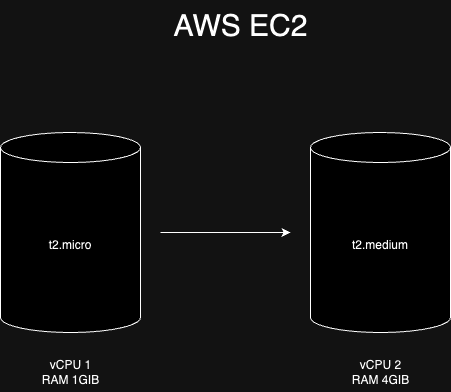
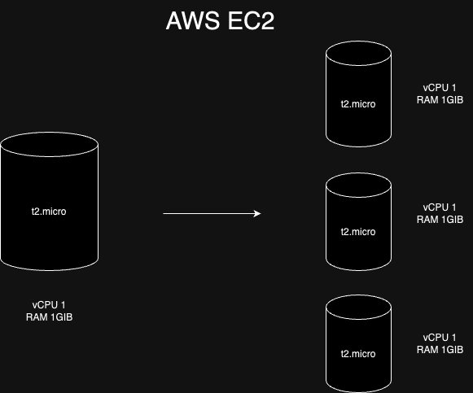
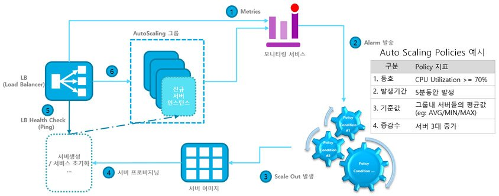
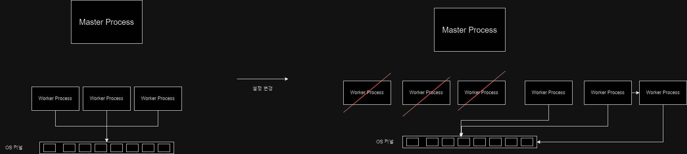

## Scale up과 Scale out

일반적으로 자체 서버를 가지고 있는 극히 일부의 회사들을 제외하고 대부분의 회사들은 AWS와 같이 클라우드 서비스를 통해 서비스를 운영한다. 즉 AWS에서 제공하는 가상 서버를 이용한다. 가상 서버를 이용하는 장점 중에 하나가 바로 가상서버이기 때문에 Auto Scaling에 유리하다는 것이다. Auto Scaling이 무엇인지 이해하려면 Scale up과 Scale out을 이해하고 있어야 한다.

### Scale up

AWS EC2로 예를 들어보자. 기존 서비스는 t2.micro 인스턴스로 운영 중이라고 가정한다. t2.micro는 가상 CPU가 1개이고 메모리도 1GiB이다. 트래픽이 많지 않은 서비스라면 해당 스펙으로도 운영이 가능할 것이다. 그런데 점점 트래픽이 늘어나며 t2.micro 스펙으로는 성능에 문제가 발생하는 상황까지 와버렸다. 이 때 보다 상위 스펙을 가진 t2.medium으로 인스턴스를 변경하면 컴퓨팅 파워가 늘어나기 때문에 보다 많은 트래픽을 받을 수 있게 된다.

이렇게 서버의 스펙 자체를 상향시키는 작업을 **Scale up**이라 한다. 그런데 이렇게 스펙을 무작정 높이는게 좋다고만 볼 수 있을까? 가상 서버라 하여도 인스턴스 스펙을 변경하는데는 다소 시간이 소요되고 그만큼 서비스 운영에 지장이 간다. 또한 성능을 올리게 되면 그만큼 비용도 많이 든다.  

### Scale out

트래픽이 많아질 때 서버의 스펙을 높이는게 아니라 서버의 갯수를 늘리는 방식을 Scale out이라 한다. 서버의 갯수가 늘어났으니 기존에 하나의 서버에 몰렸던 트래픽을 여러 서버에 나눠서 처리할 수 있다.

Scale out은 Scale up보다 비용측면에서 유리하다. 당연히 서버 개수를 늘리면 비용도 같이 증가하겠지만 성능을 높이는 것보다는 저렴하다.

<table>
  <tr>
    <th>유형</th>
    <th>vCPU</th>
    <th>RAM</th>
    <th>온디맨드 요금(시간당)</th>
  </tr>
  <tr>
    <td>t2.micro</td>
    <td>1</td>
    <td>1.0</td>
    <td>0.0116 USD</td>
  </tr>
  <tr>
    <td>t2.medium</td>
    <td>2</td>
    <td>4.0</td>
    <td>0.0464 USD</td>
  </tr>
</table>

위 표를 보면 알 수 있듯이 t2.micro에서 t2.medium으로 Scale up하면 비용이 4배 증가한다. 그런데 t2.micro를 3개로 Scale out하면 메모리는 1GiB 적지만 vCPU는 1이 더 많아 비슷한 성능으로 더 저렴하게 트래픽을 처리할 수 있다. 따라서 가상서버를 이용하는 대부분의 경우 트래픽이 늘어나면 Scale out방식으로 처리한다.

## Auto Scaling

Scale out으로 늘어난 서버가 트래픽이 줄어들었음에도 계속 유지되고 있으면 낭비일 것이다. 트래픽의 양에 따라, 정확히는 트래픽에 따른 **서버 리소스의 상태**에 따라 서버가 늘어났다 줄어들었다하면 효율적인 서비스 운영이 가능할 것이다. 이처럼 서버의 인스턴스 수를 리소스 상태(Metric 값)에 따라 자동적으로 조절하는 것을 Auto Scaling이라 한다.

그렇다면 AWS를 기준으로 Auto Scaling은 어떻게 동작할까?
(출처: https://m.post.naver.com/viewer/postView.naver?volumeNo=29960975&memberNo=36733075)

위 사진과 같이

1. 로드밸런서에서 모니터링 서비스(AWS cloud watch)에 Metric 값을 주기적으로 보낸다.
2. 모니터링 서비스는 Metric 값이 지정한 Policy(ex. CPU 사용률)에 부합하면 오토 스케일링 그룹에 알림을 보낸다.
3. 오토 스케일링 그룹은 Scale out을 실행한다.
4. 오토 스케일링 정책에 설정해둔 서버 증가분에 따라 프로비저닝을 수행한다.
5. 로드 밸런서에서 health check를 위해 새로 생긴 인스턴스에 http 통신을 시도한다.
6. health check에서 지정한 http 상태값(ex. 200)이 반환되면 로드밸런서에 지정하고 로드밸런서는 트래픽을 전달한다.

이 대목에서 중요하다고 생각하는 건 로드밸런서이다. 결국 Auto Scaling이 잘 작동하려면 로드밸런서가 새로 생기거나 혹은 없어진 서버에 대한 요청처리를 잘해야하기 때문이다. 즉 서버가 새로 생겼다면 요청이 서버에 전달될 수 있도록 해야하고 서버가 없어졌다면 해당 서버에 더이상 요청이 가지 않도록 설정을 변경해야 한다.

로드밸런서도 하나의 서버인데 만약 이렇게 설정이 바뀌고 서버를 재가동시켜야 한다면 어떨까? 사용자의 요청을 안정적으로 처리해야 하는 서비스 운영에 막대한 지장이 생길 것이다. 여기서 바로 Nginx가 로드밸런서로 많이 사용되는 이유가 나온다.

## Nginx는 어떻게 동작하는가

[Nginx 정리](../spring_mvc_1/2023-10-31-was.md)

위 글에서 Nginx의 주요한 특징은 Master Process가 Nginx의 설정파일을 기반으로 Worker Process를 만들고 Worker Process가 요청을 처리한다는 점이라 적었다. 이 때 OS 커널에서 Queue의 형태로 이벤트(커넥션 생성, I/O작업 등)들을 Worker Process에 넘겨주고 Worker Process는 해당 Queue에서 이벤트를 읽어 처리한다.

즉 Nginx 설정이 바뀌었을 때(http 요청을 넘겨줄 새로운 서버가 추가 됐을 때 또는 서버가 없어졌을 때) 서버 자체를 재구동할 필요 없이 Master Process는 바뀐 설정파일에 대한 새로운 Worker Process를 만들고 기존 Worker Process는 종료시키면 된다.

Nginx의 이같은 동작방식 덕분에 Auto Scaling이 쉽게 가능한 것이다.

Auto Scaling을 공부하면서 서버의 증가 감소에 따른 적절한 요청 분산처리가 어떻게 처리되고 이에 대한 로드 밸런서의 역할과 더 나아가 Nginx가 왜 로드 밸런서로 쓰이는지 잘 이해하게 됐다.

## 참고

[오토 스케일링이란](https://inpa.tistory.com/entry/AWS-%F0%9F%93%9A-EC2-%EC%98%A4%ED%86%A0-%EC%8A%A4%EC%BC%80%EC%9D%BC%EB%A7%81-ELB-%EB%A1%9C%EB%93%9C-%EB%B0%B8%EB%9F%B0%EC%84%9C-%EA%B0%9C%EB%85%90-%EA%B5%AC%EC%B6%95-%EC%84%B8%ED%8C%85-%F0%9F%92%AF-%EC%A0%95%EB%A6%AC)

[오토 스케일링 작동원리](https://m.post.naver.com/viewer/postView.naver?volumeNo=29960975&memberNo=36733075)

[우아한 테코톡 Nginx](https://www.youtube.com/watch?v=6FAwAXXj5N0)