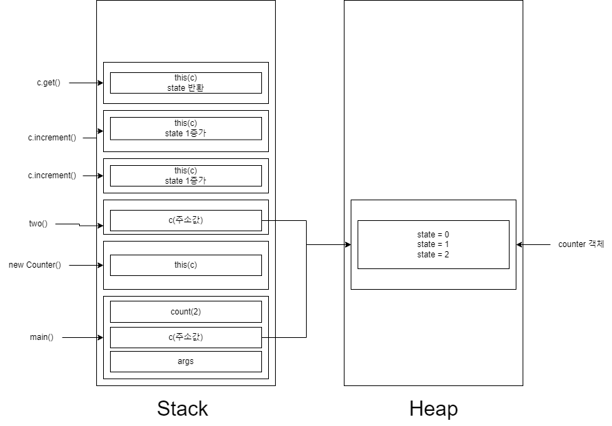

유튜브 채널 쉬운코드의 메모리 관련 영상을 정리해보았다.

## runtime이란?

어플리케이션이 <b>메모리에 올라가</b> 실행중인 상태

## Stack

메서드의 지역변수, 매개변수가 저장되는 공간. 스택 프레임의 형태로 저장되고 메서드가 호출될 때 생성된다.

<div style="display: flex; flex-direction: column; justify-content: left; align-items: center; width: 100%; height: 5rem; background-color: lightgray; padding: 10px;">
   <div>생성자가 호출될 때도 스택 메모리에 스택프레임이 쌓인다.</div>
   <div>스택메모리에 정해진 용량보다 스택 프레임이 쌓이는 정도가 넘어가면 StackOverflow에러가 발생한다. 재귀함수에서 종종 발생한다.</div>
</div>

## Heap

객체가 저장되는 공간.

## 어플리케이션이 동작할 때 Stack, Heap에서는 무슨 일이?

```java

public class Main {
  public static void main(String[] args){
    Counter c = new Counter();
    two(c)
    int count = c.get();
  }

  public static void two(Counter c){
    c.increment();
    c.increment();
  }
}

public class Counter{
  private int state = 0;c.incresement();
  public void increment(){ state++; }
  public int get() { return state; }
}

```

아래 이미지와 같이 메소드 호출 시 각 스택프레임이 쌓이고 new Counter()로 생성된 객체는 heap메모리에 생성되고 스택 프레임에는 해당 주소값이 할당된다. 즉 two(c)로 넘어간 매개변수는 heap메모리에 있는 객체의 주소값이 되고 two()에서 호출한 c.increment()는 주소값이 가리키고 있는 객체의 인스턴스 변수 state를 증가시킨다.


