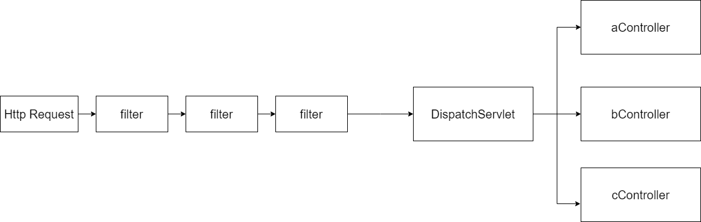

사내에서 쓰고 있던 스프링부트 버전은 2.0.4였다. 보안문제도 있고 스프링부트 3점대가 나오고 있는 상황에서 너무 낮은 버전을 쓰고 있는 것 같아 2.7.14로 버전을 업그레이드 했다. 버전이 바뀌면서 스프링 자체적으로 작동방식이 많이 변경되어 여러 수정작업을 거쳤다.

그 중 Spring Security와 관련한 수정작업을 하며 Spring Security에 대한 이해가 부족함을 느꼈다. 이번 기회에 Spring Security를 공부하겠다는 마음으로 글을 작성해봤다.

## Spring Security에 대해 알아보자



서블릿 컨테이너는 DispatchServlet이 Http Request를 가지고 URL에 매핑되어 있는 Controller에 요청을 전달하고 로직을 수행한 후 Http Response를 반환하는 구조로 되어 있다. Http Request는 곧바로 DispatchServlet으로 도달하는게 아니라 앞 단에서 여러 Filter들을 거치게 된다. Spring Secutiry는 이 하나의 Filter를 의미하며 이름에서도 알수 있듯이 보안관련 작업(인증, 인가 등)을 처리하는 Filter이다.

그런데 주의해야할 건 Filter 객체는 Servlet 컨테이너에 등록되어 있는 것이다. 즉 Spring Application Context의 Bean들과는 다른 생명주기를 가진다. 그럼 Spring은 Filter에 정책을 적용하려면 어떻게 했을까? 이 때 등장하는게 DelegatingFilterProxy이다.

> Spring provides a Filter implementation named DelegatingFilterProxy that allows bridging between the Servlet container’s lifecycle and Spring’s ApplicationContext.(https://docs.spring.io/spring-security/reference/servlet/architecture.html#servlet-filterchainproxy)

### DelegatingFilterProxy


DelegatingFilterProxy는 이름에서도 알 수 있듯이 Proxy(대리자) 객체이다. 즉 Filter를 위임하는 대리자 객체이다. DelegatingFilterProxy는 Servlet Container의 기본적인 Filter에 등록되어 있지만 실제 filter로직은 spring bean으로 등록되어 있는 Filter 객체를 찾아 해당 객체에 책임을 위임하는 역할을 한다.

```java
// DelegatingFilterProxy.java

  @Override
	public void doFilter(ServletRequest request, ServletResponse response, FilterChain filterChain)
			throws ServletException, IOException {

		// Lazily initialize the delegate if necessary.
		Filter delegateToUse = this.delegate;
		if (delegateToUse == null) {
			synchronized (this.delegateMonitor) {
				delegateToUse = this.delegate;
				if (delegateToUse == null) {
					WebApplicationContext wac = findWebApplicationContext();
					if (wac == null) {
						throw new IllegalStateException("No WebApplicationContext found: " +
								"no ContextLoaderListener or DispatcherServlet registered?");
					}
					delegateToUse = initDelegate(wac);
				}
				this.delegate = delegateToUse;
			}
		}

		// Let the delegate perform the actual doFilter operation.
		invokeDelegate(delegateToUse, request, response, filterChain);
	}

  protected Filter initDelegate(WebApplicationContext wac) throws ServletException {
    // WebApplicationContext에서 Filter Bean을 찾아서 할당
		String targetBeanName = getTargetBeanName();
		Assert.state(targetBeanName != null, "No target bean name set");
		Filter delegate = wac.getBean(targetBeanName, Filter.class);
		if (isTargetFilterLifecycle()) {
			delegate.init(getFilterConfig());
		}
		return delegate;
	}

```

위 코드가 filter를 bean에 위임하는 기능을 하는 것이다. 그럼 궁금한게 initDelegate에서 getTargetBeanName메소드에서 가져오는 값은 무엇일까?

DelegatingFilterProxy 클래스의 생성자를 호출하는 코드를 조회해보면 DelegatingFilterProxyRegistrationBean.java에서 아래 코드를 찾을 수 있다.

```java
    @Override
	public DelegatingFilterProxy getFilter() {
		return new DelegatingFilterProxy(this.targetBeanName, getWebApplicationContext()) {

			@Override
			protected void initFilterBean() throws ServletException {
				// Don't initialize filter bean on init()
			}

		};
	}
```

this.targetBeanName은 DelegatingFilterProxyRegistrationBean의 생성자에서 할당하고 있으므로 DelegatingFilterProxyRegistrationBean의 생성자를 호출하는 코드를 조회해보면 SecurityFilterAutoConfiguration.java에서 아래 코드를 찾을 수 있다.

```java
    @Bean
	@ConditionalOnBean(name = DEFAULT_FILTER_NAME)
	public DelegatingFilterProxyRegistrationBean securityFilterChainRegistration(
			SecurityProperties securityProperties) {
		DelegatingFilterProxyRegistrationBean registration = new DelegatingFilterProxyRegistrationBean(
				DEFAULT_FILTER_NAME);
		registration.setOrder(securityProperties.getFilter().getOrder());
		registration.setDispatcherTypes(getDispatcherTypes(securityProperties));
		return registration;
	}

```

드디어 실마리가 보인다. DEFAULT_FILTET_NAME, 즉 상수화 되어 있는 변수가 있고 이는 

```java
 private static final String DEFAULT_FILTER_NAME = AbstractSecurityWebApplicationInitializer.DEFAULT_FILTER_NAME;
```

이렇게 초기화 되어 있다. AbstractSecurityWebApplicationInitializer.java로 가보면

```java
public abstract class AbstractSecurityWebApplicationInitializer implements WebApplicationInitializer {

	private static final String SERVLET_CONTEXT_PREFIX = "org.springframework.web.servlet.FrameworkServlet.CONTEXT.";

	public static final String DEFAULT_FILTER_NAME = "springSecurityFilterChain";

	private final Class<?>[] configurationClasses;

...

}
```

드디어 찾았다. springSecurityFilterChain이라는 이름으로 등록된 bean 객체가 결국 Filter로 등록되는 것이다. 기왕 여기까지 파헤쳐 봤으니 springSecurityFilterChain 이라는 이름의 bean은 어디서 등록하는지까지만 확인해보자.

```java
@Configuration(proxyBeanMethods = false)
public class WebSecurityConfiguration implements ImportAware, BeanClassLoaderAware {
  
  ...

  @Bean(name = AbstractSecurityWebApplicationInitializer.DEFAULT_FILTER_NAME)
	public Filter springSecurityFilterChain() throws Exception {
		boolean hasFilterChain = !this.securityFilterChains.isEmpty();
		if (!hasFilterChain) {
			this.webSecurity.addSecurityFilterChainBuilder(() -> {
				this.httpSecurity.authorizeHttpRequests((authorize) -> authorize.anyRequest().authenticated());
				this.httpSecurity.formLogin(Customizer.withDefaults());
				this.httpSecurity.httpBasic(Customizer.withDefaults());
				return this.httpSecurity.build();
			});
		}
		for (SecurityFilterChain securityFilterChain : this.securityFilterChains) {
			this.webSecurity.addSecurityFilterChainBuilder(() -> securityFilterChain);
		}
		for (WebSecurityCustomizer customizer : this.webSecurityCustomizers) {
			customizer.customize(this.webSecurity);
		}
		return this.webSecurity.build();
	}
}
```

아까 봤던 DEFAULT_FILTER_NAME 즉 springSecurityFilterChain라는 이름으로 bean을 등록하는 코드이다. 이 코드가 아주 중요한 코드이다. 단락이 길어졌으니 정리해보자면

1. Filter는 Servlet Container의 객체이므로 Spring에서 설정을 해주기 위해 DelegatingFilterProxy라는 객체가 Spring의 Bean과 연결해주는 역할을 한다.

2. 이 때 bean은 ApplicationContext에 등록되어 있는 bean을 가져오는데 기본적으로 springSecurityFilterChain라는 이름의 bean이 할당된다.

3. springSecurityFilterChain은 스프링부트 자동설정방식에 의해 호출되는 WebSecurityConfiguration.java에서 생성된다.

### SecurityFilterChain

```java
for (SecurityFilterChain securityFilterChain : this.securityFilterChains) {
	this.webSecurity.addSecurityFilterChainBuilder(() -> securityFilterChain);
}
```

위에 springSecurityFilterChain bean을 생성 하는 코드에서 일부를 가져왔다. 코드는 단순하다. SecurityFilterChain 객체 배열을 반복문을 돌려 하나씩 Filter Chain에 등록하는 것이다. 이 코드를 왜 가져 왔냐면 이게 바로 개발자들이 만든 Security 정책을 등록하는 코드이기 때문이다.

```java
@Configuration
@EnableWebSecurity
public class SecurityConfig {

    @Bean
    public SecurityFilterChain filterChain(HttpSecurity http) throws Exception {
        http
            .csrf(Customizer.withDefaults())
            .authorizeHttpRequests(authorize -> authorize
                .anyRequest().authenticated()
            )
            .httpBasic(Customizer.withDefaults())
            .formLogin(Customizer.withDefaults());
        return http.build();
    }

}
```

위 코드는 [Spring Security 가이드 문서](https://docs.spring.io/spring-security/reference/servlet/architecture.html#servlet-filterchainproxy)에 있는 예시코드이다. SecurityFilterChain을 반환하는 bean을 만들고 있다. 이렇게 만든 bean이 for문을 통해 할당되는 것이다.


위 사진이 지금까지 설명했던 과정을 도식화한 것이다.

아직 Spring Security에 대해 알아야할 게 많지만 이번 글을 통해 대략 Spring Security가 어떻게 동작하는지 알게 되었다. 추가적인 내용은 다른 글을 통해 정리해봐야겠다.

## 참고

[Spring Security 가이드 문서](https://docs.spring.io/spring-security/reference/servlet/architecture.html#servlet-filterchainproxy)