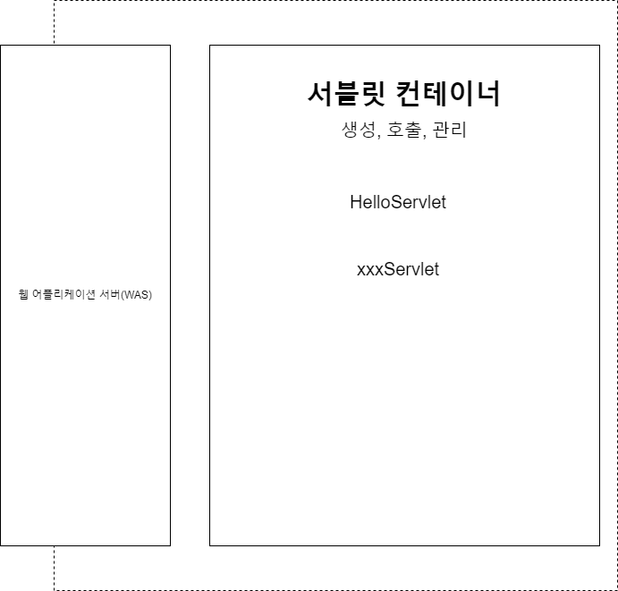
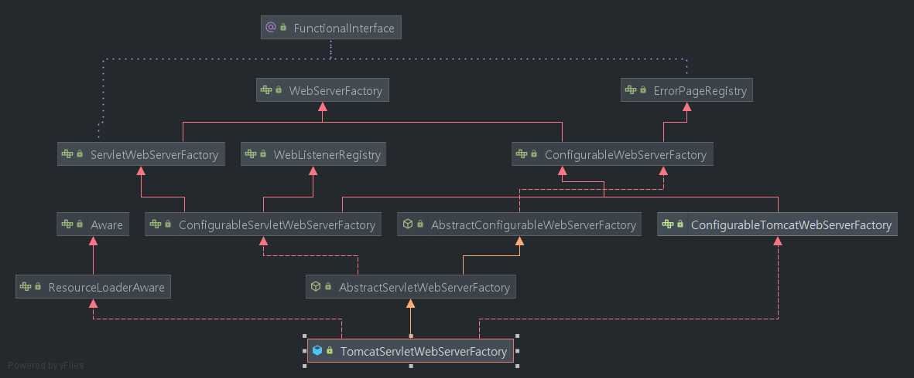
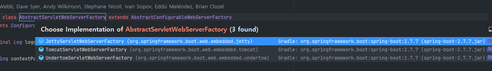

## 서블릿이란?

먼저 WAS가 HTTP 요청을 받고 처리하는 과정을 생각해보자.

1. 서버 TCP/IP 대기, 소켓 연결
2. HTTP 요청 메시지를 파싱해서 읽기
3. HTTP 메소드가 뭔지, 어떤 URL인지 체크
4. CONTENT-TYPE 확인
5. HTTP 메시지 바디 내용 파싱
6. URL에 따른 비즈니스 로직 수행 --> 이게 가장 중요함.
7. HTTP 응답 메시지 생성
8. TCP/IP에 응답전달, 소켓 종료

개발자가 이 모든 과정을 매번 구현해야한다면 매우 귀찮고 지루한 작업이 될 것. 즉 비즈니스 로직을 개발하는데 집중할 수 없다.

이를 해결하기 위해 WAS에서는 서블릿을 제공하는데 즉 서블릿이란 비즈니스 로직에 집중하기 위해 HTTP 요청, 응답의 과정을 추상화하여 제공하는 것이라 할 수 있다.

## 서블릿 컨테이너

서블릿은 개발자가 직접 호출하는게 아니라 서블릿 컨테이너를 통해 관리한다. 생성, 호출, 삭제까지 생명주기 전체를 관리한다.



- 서블릿을 지원하는 WAS를 서블릿 컨테이너라고 한다.
- 서블릿 객체는 **싱글톤으로 관리**

  - 최초 로딩 시점에 서블릿 객체를 미리 만들어두고 재활용
  - 모든 HTTP 요청은 동일한 서블릿 객체 인스턴스에 접근
  - 따라서 공유변수 사용에 주의해야한다. 왜? WAS는 동시요청 처리를 위한 멀티 스레드를 지원하기 떄문.

  > 여러 스레드에서 같은 서블릿 객체를 사용하기 때문에 변수도 같은 변수에 접근하게 됨. 한 스레드에서 변수를 참조하고자 할 떄 다른 스레드에서 변경을 하면 예상과는 다른 결과가 나올 수 있음.

- JSP도 서블릿으로 변환되어서 사용.

## 스프링부트 내장 WAS는?

문득 스프링 부트는 내장 WAS가 있는데 이는 어떻게 실행되는지 궁금해졌다. 먼저 구현체를 보면 구현체는 TomcatServletWebServerFactory이고 최상단 인터페이스는 WebServerFactory이다.



또한 아래 사진과 같이 WebServerFactory의 구현체는 tomcat, jetty등 여러개가 있다. 스프링부트는 기본적으로 tomcat을 사용한다.



아래 코드는 TomcatServletWebServerFactory.java의 일부이다.

```java
@Override
	public WebServer getWebServer(ServletContextInitializer... initializers) {
		if (this.disableMBeanRegistry) {
			Registry.disableRegistry();
		}
		Tomcat tomcat = new Tomcat();
		File baseDir = (this.baseDirectory != null) ? this.baseDirectory : createTempDir("tomcat");
		tomcat.setBaseDir(baseDir.getAbsolutePath()); // root 디렉토리 생성
		for (LifecycleListener listener : this.serverLifecycleListeners) {
			tomcat.getServer().addLifecycleListener(listener);
		}
		Connector connector = new Connector(this.protocol); // http 프로토콜 연결 객체 생성
		connector.setThrowOnFailure(true);
		tomcat.getService().addConnector(connector);
		customizeConnector(connector);
		tomcat.setConnector(connector); // 톰캣 was 객체에 http 프로토콜 연결
		tomcat.getHost().setAutoDeploy(false);
		configureEngine(tomcat.getEngine());
		for (Connector additionalConnector : this.additionalTomcatConnectors) {
			tomcat.getService().addConnector(additionalConnector);
		}
		prepareContext(tomcat.getHost(), initializers);
		return getTomcatWebServer(tomcat); // 톰캣 was 실행
	}
```
