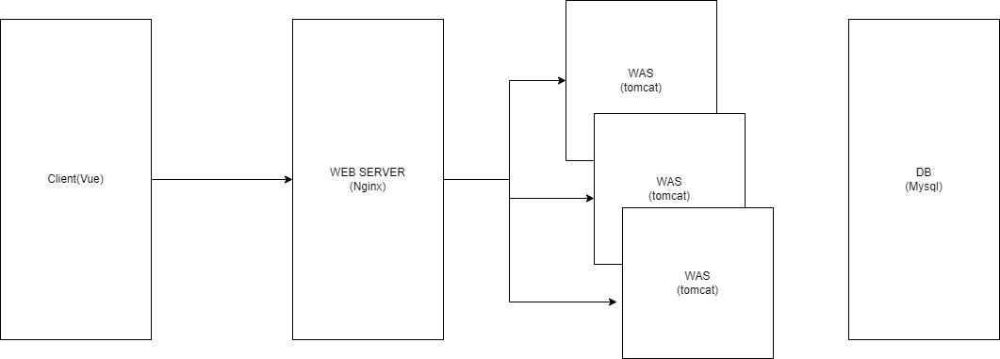

## 웹 서버

- HTTP 기반으로 동작
- 정적 리소스 제공, 기타 부가기능
- 예) nginx, apache

> 정적 리소스란 html, css, js, image 등 서버에 저장되어 있는 파일을 의미한다.

## 웹 어플리케이션 서버

- HTTP 기반으로 동작
- 웹 서버 기능을 포함
- 프로그램 코드를 실행해서 어플리케이션 로직 수행
  - 동적 HTML, HTTP API
  - 서블릿, JSP, 스프링 MVC
- 예) 톰캣, JETTY

## 가장 간단한 웹 시스템 구축 - WAS, DB

클라이언트 -- WAS -- DB

WAS에서 정적 리소스, 어플리케이션 로직을 전부 처리
문제는 정적 리소스를 처리하는 과정에서 어플리케이션 로직을 처리하지 못할 수 있음. 부하가 많을경우 WAS가 죽을 수도 있다. 

## 기본적인 웹 시스템 - WER SERVER, WAS, DB

클라이언트 -- WEB SERVER -- WAS -- DB

WEB SERVER에서는 정적 리소스를 처리. WAS에서는 로직처리에 집중. 
부하가 많아도 역할이 분리 되어 있으므로 안정적으로 처리 가능하며, 역할이 분리되어 있기 때문에 스케일 아웃(수평확장)에 유리하다.

## 번외) 내가 다니는 회사는 어떻게?

현재 재직 중인 회사는 AMAZON S3를 통해 정적 웹사이트를 호스팅하고 WAS에서는 HTTP API만 처리한다. 도식으로 표현하자면 아래와 같다.



회사에서는 AWS Elastic Beanstalk를 사용하고 있다. 해당 서비스는 간단히 말해 로드 밸런서 역할을 하는 WEB SERVER와 실제 WAS가 구동되는 EC2인스턴스 관리를 쉽게 해준다. EC2는 가상 서버이므로 사용량(ex. CPU 사용률)에 따라 인스턴스 개수를 증가 또는 감소 시킬 수 있다.

## WEB SERVER의 역할은 정적 리소스를 관리하는 것 뿐일까?

앞선 내용에서 WEB SERVER의 역할은 정적 리소스를 관리하는 것이라 말했다. 그럼 지금 회사와 같이 정적 리소스는 클라이언트에서 자체적으로 해결하는 경우에도 WEB SERVER를 두는 이유는 무엇일까?

### 로드밸런서

앞서 로드 밸런서를 언급했다. 로드 밸런서란 많은 트래픽이 몰릴 때 실제 이를 처리하는 서버들에 트래픽을 적절히 분산시키는 역할을 하는 장치 또는 기술을 의미한다. 즉 클라우드 환경과 같이 서버를 스케일 아웃하는 방식으로 운영하고자 할 때 각 서버에 적절히 트래픽을 분산시켜줄 로드밸런서를 두는 것은 필수적이다. 로드밸런서의 역할을 주로 WEB SERVER에서 수행한다.

### 로드 밸런싱을 사용하면 뭐가 좋은가?

1.어플리케이션 가용성

만약 하나의 서버가 오류가 발생했을 때 로드밸런서는 이를 감지해 정상 작동하고 있는 다른 서버로 요청을 리다이렉션하여 사용자의 요청을 처리할 수 있다. 따라서 어플리케이션이 중지되는 일을 방지할 수 있고 오류에 유연하게 대응할 수 있게 된다.

2.어플리케이션 보안

공격자가 대량의 트래픽을 일으키거나 할 때 로드밸런서는 트래픽을 제한하거나 분산시켜 영향을 최대한 줄일 수 있다. 또한 실질적으로 로직을 처리할 서버 앞단에서 요청이 한번 거쳐가야하기 때문에 네트워크 방화벽을 설정해 라우팅을 시킬 수도 있다.

>NGINX에서 대역폭을 제한하려면 클라이언트에 대한 응답 전송 속도를 제한하는 limit_rate 지시문을 사용합니다. 위치 내의 HTTP, 서버, 위치 및 if 문에서 유효합니다. 블록이며 기본적으로 주어진 컨텍스트에 대한 속도 제한을 초당 바이트 수로 지정합니다. 메가바이트에 m을 사용하거나 기가바이트에 g를 사용할 수도 있습니다.

>또 다른 관련 지시어는 limit_rate_after로, 지정된 양의 데이터가 전송될 때까지 연결 속도가 제한되지 않도록 지정합니다. 이 지시어는 HTTP, 서버, 위치 및 \위치 블록 내의 if 문에서 설정할 수 있습니다.

```text
location /documents {
        limit_rate 20k; // 초당 최대 20킬로바이트의 트래픽을 감당.
        limit_rate_after 500k;  
}
```

3.어플리케이션 성능

로드밸런서는 많은 트래픽을 적절히 분산시키기 때문에 지연시간을 최소화 할 수 있다. 따라서 어플리케이션의 성능을 향샹시킬 수 있다.

### 참고 자료

[로드 밸런싱1](https://m.post.naver.com/viewer/postView.naver?volumeNo=27046347&memberNo=2521903)

[로드 밸런싱2](https://aws.amazon.com/ko/what-is/load-balancing/)

[Nginx limit rate](https://ko.linux-console.net/?p=2673)